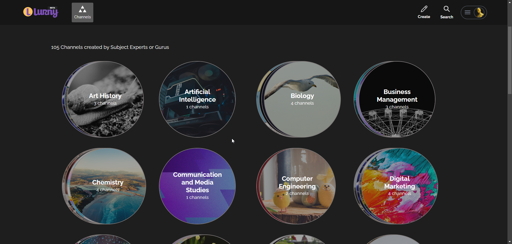
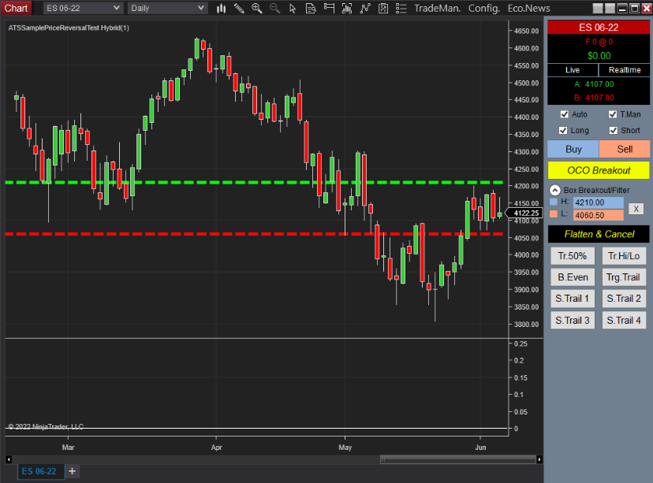

###

<h1 align="center">Senior Trading & Web Developer</h1>

 

<!--

  
  

 -->
 
<!-- <h1 align="center">Lurny Company</h1>
 

  
  

 
<h1 align="center">Trading Strategy</h1>
 
   -->
  <!-- 
 -->
  <!--  -->
  <!-- 
 -->
  <!--  -->
<!-- 
 -->
<!-- 

  

  
  

  

 -->

###

<h2 align="center">Popular Software Tools & Programming Languages</h2>

###

 

<table align="center">
  <tr>
    <td align="center" width="128">
      
       JavaScript
    </td>
    <td align="center" width="128">
      
       TypeScript
    </td>
    <td align="center" width="128">
      
       React
    </td>
    <td align="center" width="128">
      
       NextJS
    </td>
    <td align="center" width="128">
      
       NodeJS
    </td>
    <td align="center" width="128">
      
       Express
    </td>
    <td align="center" width="128">
      
       MongoDB
    </td>
    <td align="center" width="128">
      
       MySQL
    </td>
  </tr>
  <tr>
    <td align="center" width="128">
      
       HTML5
    </td>
    <td align="center" width="128">
      
       Sass
    </td>
    <td align="center" width="128">
      
       Tailwind
    </td>
    <td align="center" width="128">
      
         Bootstrap
    </td>
    <td align="center" width="128">
      
       jQuery
    </td>
    <td align="center" width="128">
      
       PHP
    </td>
    <td align="center" width="128">
      
       Webpack
    </td>
    <td align="center" width="128">
      
       VsCode
    </td>
  </tr>
  <tr>
    <td align="center" width="128">
      
       Python
    </td>
    <td align="center" width="128">
      
       C++
    </td>
    <td align="center" width="128">
      
       C#
    </td>
    <td align="center" width="128">
      
       AWS
    </td>
    <td align="center" width="128">
      
       Github
    </td>
    <td align="center" width="128">
      
       Git
    </td>
    <td align="center" width="128">
      
       Qt
    </td>
    <td align="center" width="128">
      
       PostgreSQL
    </td>
  </tr>
</table>
